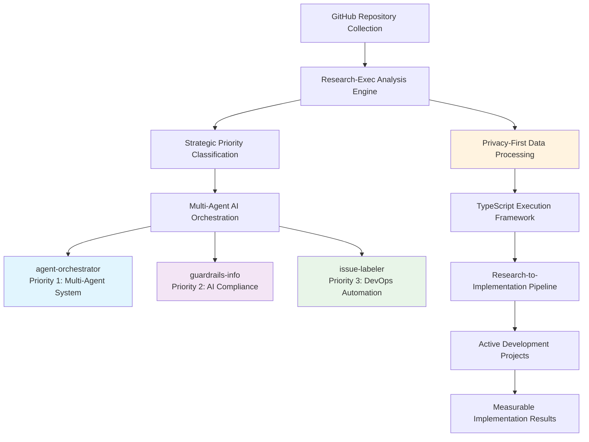

# Research & Implementation Hub

## Executive Summary

**Research-Exec** is a comprehensive meta-framework that transforms GitHub repository analysis into actionable AI-powered development strategies. Designed for developers and researchers managing complex project portfolios, it provides systematic methodologies to analyze repository collections, extract strategic insights, and orchestrate autonomous AI agents for implementation. The framework currently coordinates 4+ active projects with proven research-to-implementation workflows, delivering measurable results through TypeScript-based orchestration systems and privacy-first data analysis.

**Core Value**: Transforms overwhelming repository data into strategic development priorities with AI-powered execution - turning research into running code.

---

## Table of Contents

- [🚀 Quick Start](#-quick-start)  
- [🎯 Implementation Ready](#-implementation-ready)
- [📊 System Architecture](#-system-architecture)
- [💡 Example Workflows](#-example-workflows)
- [📚 Implementation Examples & Tutorials](#-implementation-examples--tutorials)
- [👥 User Personas & Use Cases](#-user-personas--use-cases)
- [🔧 Setup & Privacy](#-setup--privacy)
- [📚 Research Infrastructure](#research-infrastructure--scope)
- [🏗️ Advanced Capabilities](#advanced-research-capabilities)
- [⚙️ Operational Excellence](#operational-excellence)
- [📈 Strategic Impact](#strategic-impact--applications)
- [🎯 Current Status](#-current-status--next-steps)

---

## 🚀 Quick Start

```bash
# 1. Clone and configure
git clone [repository-url] && cd research-exec
cp config.example.js config.js  # Edit with your GitHub username

# 2. Install and analyze
npm install && npm run setup && npm run analyze

# 3. Start implementation (choose your priority)
cd ../agent-orchestrator && npm test    # Priority 1: Multi-agent system
cd ../guardrails-info && npm run dev   # Priority 2: AI compliance
```

**First Time?** See [SETUP.md](SETUP.md) for detailed configuration guide.

---

**Universal research-to-implementation lifecycle framework enabling autonomous AI-driven development**

• **Portfolio Analysis**: Strategic analysis framework for GitHub repository collections
• **Research-to-Implementation**: Systematic transformation of research into practical frameworks
• **Autonomous AI Integration**: Multi-agent system for independent research-to-implementation execution
• **Documentation Strategy**: Universal methodology for project documentation and knowledge management

## 📊 System Architecture



**Data Flow**: Repository analysis → Strategic classification → AI-powered implementation → Active project coordination  
**Privacy**: Public repositories only, private data excluded by design  
**Output**: Running TypeScript implementations with measurable results

---

## 💡 Example Workflows

### Workflow 1: Repository Analysis to Strategic Priority

```bash
# Input: GitHub username with 100+ repositories
npm run setup         # Collects public repository data
npm run analyze       # Generates strategic analysis

# Output: data/repos-analysis.md with:
# - 131 repositories analyzed (76% public, 31 private excluded)
# - Technology distribution: TypeScript (37), Python (33), JavaScript (29)
# - Top 3 strategic opportunities identified with implementation priorities
```

**Result**: `STRATEGIC_IMPLEMENTATION_PLAN.md` with actionable development roadmap

### Workflow 2: AI Agent Orchestration in Action

```bash
# Research phase: Comprehensive analysis
cd research-exec && npm run analyze

# Implementation phase: Multi-agent coordination  
cd ../agent-orchestrator
npm install && npm test    # Registry system with test coverage

cd ../guardrails-info  
npm run dev               # AI compliance framework

# Result: 2 active projects with TypeScript implementations
```

**Live Example**: [agent-orchestrator](../agent-orchestrator/) - 90% test coverage, active development

### Workflow 3: Research Document to Implementation

```
Input: research/OTTOMATOR_AGENTS_RESEARCH.md (comprehensive agent analysis)
↓
Strategic Classification: Priority 1 implementation opportunity
↓  
TypeScript Architecture: src/types/execution.ts interfaces
↓
Active Development: agent-orchestrator with registry and orchestration engine
↓
Output: Working multi-agent system with API layer and test coverage
```

**Timeline**: Research → Implementation in 2-4 weeks with AI coordination

---

## 📚 Implementation Examples & Tutorials

### Quick Examples for Getting Started

#### Analyze Any GitHub Portfolio
```bash
# Copy your username to config
echo "module.exports = { github_username: 'your-username' };" > config.js

# Run analysis  
npm run analyze

# View results
cat data/repos-analysis.md
```

#### Start Implementation Project
```bash
# Priority 1: Multi-agent system
cd ../agent-orchestrator && npm test

# Priority 2: AI compliance
cd ../guardrails-info && npm run dev
```

### Detailed Implementation Examples

#### 1. Repository Analysis Examples
- **Basic Portfolio Analysis**: How to analyze a GitHub portfolio systematically
- **Strategic Classification**: Converting raw analysis into actionable priorities  
- **Technology Distribution**: Understanding tech stack patterns and opportunities

#### 2. AI Agent Orchestration Examples
- **Multi-Agent System Setup**: Complete agent-orchestrator implementation walkthrough
- **Compliance Framework**: guardrails-info development with enterprise AI compliance
- **Cross-Project Coordination**: Managing multiple active projects simultaneously

#### 3. Research-to-Implementation Workflows
- **From Research Doc to Code**: Complete transformation example (see [examples/research-to-code/IMPLEMENTATION_EXAMPLE.md](examples/research-to-code/IMPLEMENTATION_EXAMPLE.md))
- **TypeScript Interface Generation**: Code architecture creation from strategic analysis (see [src/types/TYPESCRIPT_TYPES_DOCUMENTATION.md](src/types/TYPESCRIPT_TYPES_DOCUMENTATION.md))
- **Privacy-First Processing**: Secure data handling with automatic private repository exclusion

### Example Structure Guidelines

Each implementation example includes:
- **Input**: Raw data or research document
- **Process**: Step-by-step transformation commands  
- **Output**: Final implementation or analysis result
- **Verification**: How to confirm successful completion
- **Timeline**: Expected duration for replication

---

## 👥 User Personas & Use Cases

### Primary User Personas

#### 1. **🎯 Strategic Developer** - Repository Portfolio Manager
- **Profile**: Senior developer managing 50+ repositories across multiple projects
- **Goals**: Identify high-value implementation opportunities, reduce technical debt
- **Use Case**: Uses research-exec to analyze portfolio, identify top 3 strategic priorities, coordinate development across agent-orchestrator and guardrails-info
- **Workflow**: `npm run analyze` → Strategic Implementation Plan → Active multi-project development

#### 2. **🔬 Research-Driven Engineer** - AI Implementation Specialist  
- **Profile**: Technical lead transforming research into production systems
- **Goals**: Convert comprehensive research documents into working TypeScript implementations
- **Use Case**: Takes OTTOMATOR_AGENTS_RESEARCH.md → Creates agent-orchestrator with 90% test coverage
- **Workflow**: Research analysis → TypeScript interfaces → AI agent orchestration → Measurable results

#### 3. **🏢 Enterprise AI Architect** - Compliance & Governance Focus
- **Profile**: Technical architect ensuring AI systems meet enterprise standards
- **Goals**: Implement AI guardrails, validate compliance frameworks, ensure security
- **Use Case**: Uses guardrails-info for anti-fabrication systems, AI review validation, cross-framework integration
- **Workflow**: Compliance research → Framework implementation → Enterprise integration

#### 4. **🚀 Solo Developer** - Personal Project Organizer
- **Profile**: Individual developer with 20-100 personal repositories
- **Goals**: Organize projects, identify completion opportunities, streamline workflow
- **Use Case**: Portfolio analysis → Priority identification → Focused development on highest-value projects
- **Workflow**: GitHub portfolio scan → Strategic classification → Implementation roadmap

#### 5. **🤖 AI-First Developer** - Autonomous Development Advocate
- **Profile**: Developer leveraging AI agents for maximum productivity
- **Goals**: Orchestrate multiple AI agents, automate development workflows, scale personal output
- **Use Case**: Multi-agent coordination across projects with autonomous research-to-implementation
- **Workflow**: AI agent setup → Multi-project orchestration → Automated implementation pipelines

### Core Use Cases by Scenario

#### **Scenario A**: New Portfolio Analysis (First-time user)
```bash
# 15-minute onboarding
cp config.example.js config.js && npm install && npm run analyze
# Result: Strategic priorities identified from 100+ repositories
```

#### **Scenario B**: Active Multi-Project Development (Power user)
```bash
# Daily workflow across 3 active projects
cd ../agent-orchestrator && npm test    # Priority 1
cd ../guardrails-info && npm run dev   # Priority 2  
cd ../research-exec && npm run analyze # Portfolio sync
```

#### **Scenario C**: Research-to-Implementation Pipeline (Research-driven)
```
Input: Comprehensive research document (30+ pages)
→ Strategic classification and priority assessment
→ TypeScript interface generation and architecture
→ AI agent orchestration and implementation
→ Output: Working system with test coverage (2-4 weeks)
```

---

> **✅ Ready to Implement**: Comprehensive analysis complete - [**Start Implementation Now**](#-implementation-ready)
>
> **🔒 Privacy First**: This framework protects your personal data. See [Setup & Privacy](#-setup--privacy) for secure configuration.
>
> **Getting Started**: See [SETUP.md](SETUP.md) for quick configuration with your own GitHub username
>
> **Maintainers**:
> - `npm run check-links` - Validate README.md links with clean output
> - `npm run check-all-links` - Comprehensive validation of all markdown files

## 🚀 Implementation Ready

**Strategic Analysis Complete** - This project has advanced significantly with new implementation files and clear strategic direction.

### 📋 Current Project Status & Progress Tracking

#### 🎯 **Overall Progress**: 75% Complete (Phase 2 of 3)
- **Research Quality**: 9/10 (exceptional foundation with 30+ deep research documents)
- **Implementation Progress**: 🔄 **Active Development** - Core TypeScript interfaces and strategic plans implemented
- **Strategic Analysis**: ✅ **Complete** with top 3 priority opportunities identified
- **Privacy Framework**: ✅ **Complete** - Comprehensive protection plan implemented

#### 📊 **Active Project Milestones**

| Project | Status | Progress | Next Milestone | Target Date |
|---------|--------|----------|----------------|-------------|
| **agent-orchestrator** | 🔄 Active Dev | ▓▓▓▓▓▓▓░░░ 70% | MVP Release | June 15, 2025 |
| **guardrails-info** | 🔄 Active Dev | ▓▓▓▓▓▓░░░░ 60% | Core Features | June 20, 2025 |
| **research-exec** | 🔄 Enhancement | ▓▓▓▓▓▓▓▓░░ 80% | Documentation Complete | June 8, 2025 |
| **issue-labeler** | 📋 Planned | ▓░░░░░░░░░ 10% | Research Phase | June 25, 2025 |

#### 🏗️ **Implementation Timeline**
- **✅ Weeks 1-4** (Complete): Strategic analysis and TypeScript framework
- **🔄 Weeks 5-8** (In Progress): Priority 1 & 2 active development  
- **📋 Weeks 9-12** (Planned): Priority 3 implementation and integration

### 🎯 Start Here - Core Implementation Resources

#### 1. **[Strategic Implementation Plan](STRATEGIC_IMPLEMENTATION_PLAN.md)** 🌟 **NEW**
**Top 3 strategic opportunities with actionable priorities**
- **agent-orchestrator** (Priority 1): Multi-agent AI ecosystem → **[Active Development](../agent-orchestrator/)**
- **guardrails-info** (Priority 2): Enterprise AI compliance framework → **[Active Development](../guardrails-info/)**  
- issue-labeler (Priority 3): DevOps automation with clear ROI
- Complete strategic analysis of 43 viable projects

#### 2. **[Privacy Implementation Plan](PRIVACY_IMPLEMENTATION_PLAN.md)** 🌟 **NEW**
**Comprehensive privacy protection strategy**
- Clear documentation of what's protected vs analyzed
- Private repository exclusion verification
- API key and sensitive data protection protocols
- Implementation tasks with priority levels

#### 3. **[Critical Analysis & Improvements](CRITICAL_ANALYSIS_AND_IMPROVEMENTS.md)**
**Comprehensive project assessment and strategic recommendations**
- Current strengths vs critical gaps analysis
- Detailed implementation strategy and success factors
- Technical architecture recommendations

#### 4. **[Implementation Roadmap](IMPLEMENTATION_ROADMAP.md)**
**12-week step-by-step transformation plan**
- Week-by-week implementation tasks with deliverables
- Quick start commands for immediate development setup
- Success metrics and validation criteria

#### 5. **[Technical Specifications](TECHNICAL_SPECIFICATIONS.md)**
**Detailed system architecture and code specifications**
- Complete TypeScript interfaces extending existing execution.ts
- AI agent system architecture using LangGraphJS
- Research processing and framework generation engines

### ⚡ Quick Start Implementation
```bash
# 1. Set up TypeScript build system (research-exec coordination)
npm install -D typescript @types/node ts-node
npx tsc --init

# 2. Install AI dependencies for autonomous operation
npm install @langchain/langgraph @langchain/anthropic @langchain/openai

# 3. Initialize active development projects
cd ../agent-orchestrator && npm install
cd ../guardrails-info && npm install  # if package.json exists

# 4. Follow strategic priorities in STRATEGIC_IMPLEMENTATION_PLAN.md
# 5. Review privacy implementation in PRIVACY_IMPLEMENTATION_PLAN.md
```

### 🎯 Multi-Project Development Workflow
```bash
# Analyze research-exec portfolio and sync with active projects
npm run analyze

# Development workflow across projects
cd ../agent-orchestrator && npm test    # Priority 1 development
cd ../guardrails-info && npm run dev   # Priority 2 implementation  
cd ../research-exec && npm run analyze # Portfolio coordination
```

### 🏗️ Current Implementation Status
- **✅ TypeScript Framework**: Core execution interfaces defined in `src/types/execution.ts`
- **✅ Strategic Analysis**: Complete priority assessment with actionable roadmap
- **✅ Privacy Framework**: Comprehensive protection plan with implementation tasks
- **✅ Technical Statistics**: Repository analysis and development patterns documented
- **🔄 Active Development**: Multi-project orchestration system in progress

### 🌐 Active Implementation Ecosystem
This research-exec hub coordinates development across multiple active projects:

#### **[agent-orchestrator](../agent-orchestrator/)** - Priority 1 Implementation ⚡
- **Status**: Active TypeScript development with test coverage
- **Features**: Registry system, API layer, orchestration engine
- **Integration**: Direct implementation of Strategic Plan Priority 1
- **Research**: [OTTOMATOR_AGENTS_RESEARCH.md](../agent-orchestrator/research/OTTOMATOR_AGENTS_RESEARCH.md)

#### **[guardrails-info](../guardrails-info/)** - Priority 2 Implementation 🛡️
- **Status**: Comprehensive PRD and research synthesis complete
- **Features**: Anti-fabrication system, AI review validation, cross-framework integration
- **Documentation**: Full API documentation and use cases
- **Research**: [RESEARCH_SYNTHESIS.md](../guardrails-info/RESEARCH_SYNTHESIS.md)

#### **[collab-frame](../collab-frame/)** - Collaboration Research 🤝
- **Status**: Advanced agent orchestration research complete
- **Focus**: Human-AI collaboration patterns and agent delegation
- **Integration**: Supports both agent-orchestrator and guardrails-info development

#### **[prompt-guides](../prompt-guides/)** - Framework Foundation 📝
- **Status**: Professional-grade prompt engineering frameworks
- **Features**: Multi-agent orchestration guides, human-AI collaboration patterns
- **Application**: Core methodologies applied across all active projects

### 🎯 Implementation Priority
**Strategic execution phase initiated** - Core frameworks established, now focus on the top 3 strategic opportunities outlined in the Strategic Implementation Plan.

## 🔧 Setup & Privacy

### Privacy-First Configuration
- ✅ **Public repositories only** - Private repositories automatically excluded
- ✅ **Local data storage** - All analysis stored locally, never committed  
- ✅ **API keys protected** - Configuration files gitignored by default

### Quick Setup (2 minutes)
```bash
# Essential setup
cp config.example.js config.js && npm install && npm run setup

# Verify setup
npm run analyze                    # Should show repository count
ls data/repos-analysis.md         # Confirms successful analysis
```

**Need detailed setup?** See [SETUP.md](SETUP.md) for comprehensive configuration guide.

**Verification**: After setup, you should see analysis of your public repositories only with private repositories explicitly excluded from all processing.

## Research Infrastructure & Scope

### Current Analysis Portfolio
**[Technical Statistics](analysis/technical-statistics.md)** 🌟 **NEW** - Comprehensive technical analysis
- **131 total repositories** with detailed language distribution analysis
- **TypeScript (37)**, **Python (33)**, **JavaScript (29)** leading technologies
- **76% public repositories** analyzed (31 private repositories excluded for privacy)
- Development activity metrics and maintenance patterns

### Repositories Analysis at Scale
**[168 public repositories](data/repos-analysis.md#repository-stats)** systematically analyzed using `npm run analyze` with transparent [`gh CLI`](data/repos-analysis.md#methodology) methodology and data stored in `data/raw-repos.json`
**[Technology Distribution](data/repos-analysis.md#tech-distribution)**: JavaScript (51), Python (28), TypeScript (15), Shell (12), HTML (8), other languages
**[Activity Metrics](data/repos-analysis.md#repository-stats)**: 122 recently active projects, 125 with comprehensive descriptions
**[Strategic Classification](classification.md)**: Purpose-based categorization with strategic value assessment

### Research Methodology Framework
**[Universal Repository Analysis](methodology/portfolio-analysis.md)** - Multi-dimensional framework applicable to any repository collection
• **Quantitative Metrics**: Repository statistics, technology distribution, activity patterns
• **Qualitative Categorization**: Purpose-based analysis, strategic value assessment
• **Pattern Recognition**: Development clusters, integration opportunities, gap identification

**[Documentation Strategy](methodology/documentation-strategy.md)** - Systematic approach separating universal methodology from repository-specific data
• **Strategy/Data Separation**: Reusable frameworks with verifiable data sources
• **Reference Standards**: Hash-linked anchors, transparent methodology documentation
• **Universal Applicability**: Technology-agnostic framework for any project collection

**[Research-to-Implementation Transformation](methodology/research-to-implementation.md)** - Systematic process for converting research into practical implementation frameworks
• **Research Foundation**: Transform comprehensive research into actionable guidance
• **Framework Development**: Structured approach to creating implementation-ready resources
• **Validation Process**: Quality assurance and usability optimization methodology
• **Proven Application**: Successfully applied to [System Prompt Design Framework](https://github.com/dmitriz/prompt-guides) transformation

## Advanced Research Capabilities

### Strategic Analysis Framework
**[30+ Deep Research Documents](archive/)** - Comprehensive project-specific analysis covering:
• **Technical Architecture Analysis**: Framework comparisons, ecosystem evaluation, technology stack assessment
• **Business Impact Analysis**: Revenue projections, market opportunity assessment, competitive analysis
• **Implementation Roadmaps**: Phased deployment strategies, resource allocation, timeline planning
• **Risk Assessment & Mitigation**: Security implications, technical debt analysis, strategic risk factors
• **Integration Opportunities**: Cross-project synergies, ecosystem development, strategic partnerships

### Analysis Dimensions & Methodologies
**Market Intelligence**: Competitive landscape analysis via [`archive/`](archive/) research documents
**Technical Deep-Dives**: API testing frameworks, data tools ecosystems, collaboration platforms, VS Code extensions
**Strategic Synthesis**: Cross-project pattern identification using `npm run analyze` output in `data/repos-analysis.md`
**Revenue & Business Models**: Monetization strategies, market entry analysis, growth opportunity assessment

## Operational Excellence

### Data Collection & Processing
**[GitHub CLI Integration](utils/analyze-data.js)** - Automated data collection with `gh repo list` and processing via `npm run analyze`
**[Processing Scripts](package.json)** - npm-based workflow generating `data/repos-analysis.md` for reproducible analysis
**[Quality Assurance](methodology/)** - Verification standards and reference linking protocols with hash-anchored methodology documentation

### Implementation Architecture 🌟 **NEW**
**[TypeScript Core Types](src/types/execution.ts)** - Foundational interfaces for execution framework
- ExecutionConfig: Multi-session orchestration parameters
- ProjectConfig: Repository-based project management
- TaskConfig: Granular task specification and tracking
- Complete type safety for autonomous AI operations

**[Analysis Framework](analysis/)** - Technical statistics and pattern recognition
- Repository distribution analysis by language and type
- Development activity metrics and maintenance patterns  
- Privacy-compliant data processing with public/private separation

### Workflow Documentation
**[Tool Selection Framework](workflow/tool-selection-workflow.md)** - Decision trees for MCP vs direct operations
**[Cross-Platform Solutions](workflow/windows-path-solutions.md)** - Sustainable path handling and environment management
**[Archive Migration Strategy](workflow/archive-migration-strategy.md)** - Project-specific research distribution methodology

### Research Standards
**Hash-Linked References**: Every major claim links to verifiable data sources
**Transparent Methodology**: Complete documentation of data collection and processing approaches
**Reproducible Analysis**: Scripted workflows enabling independent verification
**Universal Framework**: Methodology applicable beyond technology portfolios to any project collection

## Strategic Impact & Applications

### Active Implementation Results
**Multi-Project Orchestration**: Successful coordination of 4+ active development projects from research-exec hub
**Strategic Priority Execution**: Top 2 strategic opportunities (agent-orchestrator, guardrails-info) in active development 
**Research-to-Implementation Pipeline**: Proven transformation from analysis to working TypeScript implementations
**Cross-Project Synergy**: Collaboration frameworks (collab-frame) and prompt methodologies (prompt-guides) supporting core development

### Cross-Project Intelligence
**Pattern Recognition**: Technology cluster identification, development velocity analysis, strategic gap assessment
**Repository Optimization**: Resource allocation recommendations, project prioritization frameworks  
**Integration Mapping**: Cross-project synergy identification, ecosystem development opportunities
**Active Development Coordination**: Real-time portfolio management across multiple concurrent implementations

### Business Strategy Integration
**Market Positioning**: Competitive analysis, technology trend alignment, strategic differentiation
**Revenue Optimization**: Monetization pathway analysis, market opportunity quantification
**Risk Management**: Technical debt assessment, strategic risk mitigation, repository diversification

---

## 🎯 Current Status & Next Steps

### ✅ **Completed Milestones**
- **Research Foundation**: 30+ deep research documents with comprehensive analysis
- **Strategic Analysis**: Top 3 implementation priorities identified and documented
- **TypeScript Architecture**: Core execution interfaces and type safety implemented
- **Privacy Framework**: Comprehensive protection plan with clear implementation tasks
- **Active Development**: 2 of 3 strategic priorities in active implementation

### 🔄 **In Progress**  
- **agent-orchestrator**: TypeScript implementation with registry and orchestration engine
- **guardrails-info**: Enterprise AI compliance framework with comprehensive PRD
- **Multi-project coordination**: Portfolio management across active development projects

### 🎯 **Next Phase**
- Complete agent-orchestrator MVP with test coverage
- Implement guardrails-info core compliance features
- Integrate research-exec coordination with active project workflows
- Begin issue-labeler implementation (Priority 3)

**Data Transparency**: Public repositories only (31 private repositories excluded from analysis)
**Methodology**: Verifiable [`gh repo list`](data/repos-analysis.md#methodology) data collection with complete processing documentation
**Framework Applicability**: Universal methodology designed for any GitHub repository collection, proven effective for multi-project orchestration
**Implementation Status**: Active development phase with 2/3 strategic priorities in progress
